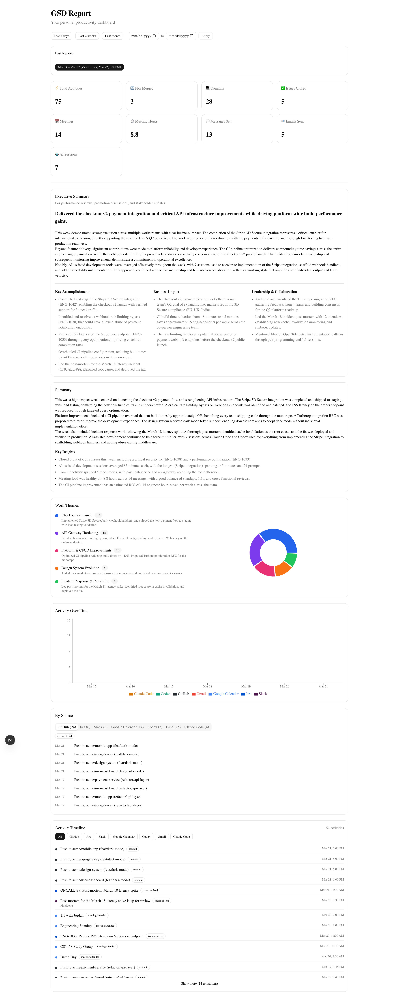

# GSD Report

**Get Stuff Done** -- A personal productivity dashboard that pulls your work activity from across your tools, uses AI to discover themes and patterns, and generates reports you can use for self-reflection, standups, and performance reviews.



## What It Does

GSD Report collects your activity from up to 9 data sources, analyzes it for common themes and productivity patterns, and presents everything in a visual dashboard:

- **Key metrics** -- commits, issues closed, meetings attended, messages sent, AI sessions
- **Executive summary** -- accomplishments, business impact, and leadership highlights written for managers and HR
- **Work themes** -- AI-discovered topics with activity counts and a breakdown chart
- **Narrative summary** -- a prose overview of your week with key insights
- **Activity timeline** -- chronological feed with source filtering (private messages excluded)
- **Per-source details** -- tabbed view of activity from each connected service

## Data Sources

| Source | What's collected |
|--------|-----------------|
| **GitHub** | Commits, PRs created/reviewed/merged, issues |
| **Slack** | Messages sent, thread context, channel participation |
| **Jira** | Issues created, updated, resolved |
| **Gmail** | Emails sent (subject lines only) |
| **Google Calendar** | Meetings attended, duration, attendee count |
| **Linear** | Issues created, updated, completed |
| **Claude Code** | Conversation sessions, tools used, projects worked on |
| **Codex** | Sessions, models used, tokens consumed, projects |
| **GitHub Copilot** | CLI sessions and VS Code chat sessions |

## Quick Start

Clone the repo and let Claude Code handle the rest:

```bash
git clone <your-repo-url> gsd-report
cd gsd-report
```

Then in Claude Code, run:

```
/setup
```

The `/setup` skill will interactively walk you through everything -- checking prerequisites, installing dependencies, creating the database, running migrations, and verifying the app starts. It checks what's already installed and only sets up what's missing.

Once setup is complete, generate your first report:

```
/gsd
```

Then open [http://localhost:3000](http://localhost:3000) to view your dashboard.

### Other date ranges

```
/gsd last 2 weeks
/gsd last month
/gsd 2026-03-01 to 2026-03-15
```

## Setup Guides

| Guide | Approach | Best for |
|-------|----------|----------|
| **[SETUP-SKILL.md](./SETUP-SKILL.md)** | Claude Code `/gsd` skill collects data via MCP integrations and local files, analyzes inline | Most users -- simpler setup, more data sources, no API costs |
| **[SETUP-API.md](./SETUP-API.md)** | Next.js app fetches from APIs directly, Claude API analyzes | Automated/scheduled reports without Claude Code |

Both approaches write to the same database and can be used together.

## Tech Stack

- **Next.js 15** (App Router) + TypeScript
- **PostgreSQL** + Prisma ORM
- **Tailwind CSS** + shadcn/ui
- **Recharts** for charts
- **Anthropic SDK** (for direct API mode analysis)

## Privacy

- DMs and private Slack channels are included in the AI analysis but never displayed in the dashboard
- Email bodies are never collected -- only subject lines and metadata
- AI conversation content is not stored -- only session metadata (project, duration, tools used)
- All data stays in your local PostgreSQL database

## Agent Compatibility

The `/setup` and `/gsd` skills are written to be agent-agnostic -- they describe _what to do_ rather than naming specific tools, so any AI coding agent should be able to follow them.

| Agent | Status |
|-------|--------|
| **Claude Code** | Tested and working |
| **Codex** | Untested -- should work, contributions welcome |
| **GitHub Copilot** | Untested -- should work, contributions welcome |

If you try the skills with Codex, Copilot, or another agent and run into issues, please open an issue or submit a PR with fixes. The skill files are in `.claude/skills/` and the agent entry points are in `AGENTS.md` and `.github/copilot-instructions.md`.

## Development

```bash
npm run dev        # Start dev server
npm test           # Run tests
npm run build      # Production build
npm run lint       # Lint
```
